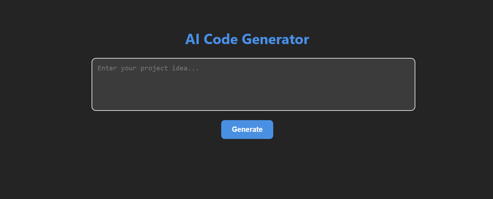

# CursorIDE

A full-stack project that provides an AI-powered IDE-like environment with a **Node.js backend** and a **React (Vite) frontend**.  
This project is structured for easy development and deployment.



---

## 📂 Project Structure

```bash
cursorIDE/
├── backend/
│   ├── node_modules/
│   ├── .env
│   ├── .gitignore
│   ├── aiGenerator.js
│   ├── package-lock.json
│   ├── package.json
│   └── server.js
│
├── frontend/
│   ├── node_modules/
│   ├── public/
│   ├── src/
│   │   ├── App.css
│   │   ├── App.jsx
│   │   ├── index.css
│   │   └── main.jsx
│   ├── .env
│   ├── .gitignore
│   ├── eslint.config.js
│   ├── index.html
│   ├── package-lock.json
│   ├── package.json
│   ├── README.md
│   └── vite.config.js
│
├── .gitignore
├── package-lock.json
├── package.json
└── README.md
```

---

## 🚀 Getting Started

Follow the steps below to run the project locally.

### 1️⃣ Clone the Repository

```bash
git clone https://github.com/Saini-Yogesh/cursorIDE.git
cd cursorIDE
```

### 2️⃣ Install Dependencies

From the root folder:

```bash
npm install
```

This will also install dependencies for both frontend and backend if you use the included scripts.

### 3️⃣ Backend Setup

```bash
cd backend
npm install
```

Create a `.env` file inside the `backend` folder:

```env
GOOGLE_API_KEY=your_gemini_api_key_here
```

Start the backend server:

```bash
npm start
```

### 4️⃣ Frontend Setup

```bash
cd ../frontend
npm install
```

Create a `.env` file inside the `frontend` folder:

```env
VITE_API_BASE_URL=http://localhost:3000   # Backend Base URL
```

Run the frontend (Vite):

```bash
npm run dev
```

### 5️⃣ Run Both (Concurrent Mode)

At the root level, add the following to `package.json`:

```json
"scripts": {
  "frontend": "cd frontend && npm run dev",
  "backend": "cd backend && npm run start",
  "dev": "concurrently \"npm run frontend\" \"npm run backend\""
}
```

Now, simply run:

```bash
npm run dev
```

This will start both frontend and backend together.

### 6️⃣ Access the App

Open [http://localhost:5173](http://localhost:5173) in your browser.

---

## 🛠️ Tech Stack

- **Backend:** Node.js, Express
- **Frontend:** React, Vite
- **Styling:** CSS
- **Environment Variables:** dotenv

---

## 📝 Notes / Customization

- Update `backend/.env` with your API keys or credentials.
- Update `frontend/.env` with the correct backend API URL.
- Use the `npm run dev` script for full-stack development.
- For production, configure frontend build and deploy backend separately.
